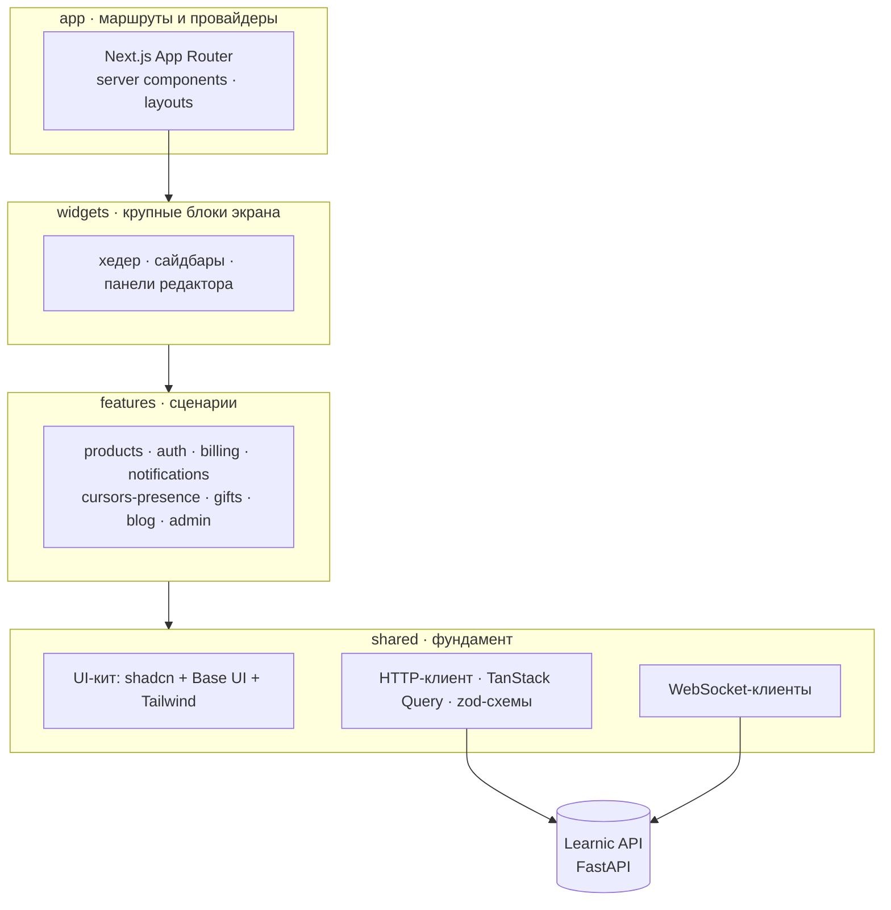

<div align="center">

# 🖥 Learnic Web

**Редактор конспектов, который открывается в браузере: блоки, формулы, чертежи — и соавтор, чей курсор виден в реальном времени.**

Фронтенд платформы Learnic: Next.js 16, React 19, Feature-Sliced Design.


[Бэкенд](https://github.com/iuriishikov/learnic) · [Архитектура](#-архитектура) · [Быстрый старт](#-быстрый-старт) · [Команды](#-команды)

</div>

---

## 🎯 Что это

Веб-клиент сайта конспектов. Автор собирает конспект из блоков и публикует версиями, читатель находит конспект в каталоге, покупает и читает.

| | Возможность |
|---|---|
| ✍️ | **Блочный редактор** на Tiptap: текст, код, изображения, перетаскивание блоков через dnd-kit |
| 🧮 | **Формулы и чертежи.** KaTeX и MathLive для математики, JSXGraph для интерактивных построений |
| 👥 | **Соавторы в реальном времени.** Присутствие и чужие курсоры приходят по WebSocket и рисуются поверх документа |
| 🔔 | **Уведомления.** Центр уведомлений в интерфейсе плюс браузерные web-push |
| 💳 | **Покупка и подарки.** Оплата, подарочные конспекты, страницы биллинга |
| 🛡️ | **Админка.** Дашборд, управление ролями, модерация блога и публикаций |
| 🌗 | **Тема и язык.** Светлая, тёмная и системная тема, интерфейс через `next-intl` |

---

## 🏗 Архитектура

Feature-Sliced Design: слои изолированы, импорт разрешён только вниз.



**Как ходят данные**

| | Механика |
|---|---|
| 🔁 | Серверные компоненты читают API напрямую, клиентские — через TanStack Query с кэшем и инвалидацией |
| 🔀 | `src/proxy.ts` и rewrite в `next.config.ts` уводят запросы на бэкенд, чтобы браузер видел один origin |
| 📡 | Живые события — курсоры, присутствие, уведомления — идут отдельным WebSocket-каналом, минуя очередь запросов |
| ✅ | Формы описаны `react-hook-form` и `zod`: одна схема валидирует и ввод, и ответ API |

---

## ⚙️ Стек

| Слой | Технология |
|---|---|
| Фреймворк | Next.js 16 (App Router), React 19 |
| Язык | TypeScript 5 |
| Стили | Tailwind CSS 4 |
| UI-кит | shadcn/ui поверх Base UI, иконки Lucide |
| Данные | TanStack Query 5 |
| Формы | react-hook-form + zod |
| Редактор | Tiptap 3 (starter-kit, link, color, text-align, underline, placeholder) |
| Математика | KaTeX, MathLive, JSXGraph |
| Drag and drop | dnd-kit (core, sortable, utilities) |
| Реальное время | WebSocket: присутствие, курсоры, уведомления |
| Push | Web Push |
| Локализация | next-intl |
| Темы | next-themes |
| Графики | Recharts |
| Анимации | Motion |
| Мелочи UI | cmdk, sonner, vaul, embla-carousel, input-otp, overlayscrollbars, react-day-picker |
| Пакеты | pnpm |
| Прод | Docker и Caddy: собственный edge или общий с API |

---

## 🚀 Быстрый старт

```bash
git clone https://github.com/iuriishikov/learnic-web && cd learnic-web
pnpm install
cp .env.dist .env.local
pnpm dev
```

Открыть `http://localhost:3000`. Бэкенд поднимается отдельно — [iuriishikov/learnic](https://github.com/iuriishikov/learnic).

---

## 🧰 Команды

| Команда | Что делает |
|---|---|
| `pnpm dev` | Дев-сервер Next.js |
| `pnpm build` | Прод-сборка |
| `pnpm start` | Запуск собранного приложения |
| `pnpm lint` | ESLint |
| `just check` | Гейт качества: eslint + tsc + прод-сборка |
| `just bootstrap` | Создать `.env` из шаблона |
| `just prod-up` | Раздельный деплой: фронтенд со своим HTTPS-edge на Caddy |
| `just prod-up-colocated` | Совмещённый деплой: фронтенд без edge, его обслуживает Caddy бэкенда |
| `just prod-down` | Остановить прод-стек |

---

## 📁 Структура

```
src/
├── app/        маршруты App Router, layouts, провайдеры
├── widgets/    крупные составные блоки экрана
├── features/   сценарии: products, auth, billing, notifications,
│               cursors-presence, gifts, blog, admin, legal
├── shared/     UI-кит, HTTP- и WebSocket-клиенты, хуки, утилиты
└── proxy.ts    проксирование запросов на бэкенд
docs/api/       контракт, по которому живёт клиент
deploy/caddy/   конфигурация edge для обоих сценариев деплоя
```

---

## 🌐 Окружение

| Переменная | Зачем |
|---|---|
| `API_URL` | Адрес бэкенда для серверных вызовов и проксирования |
| `NEXT_PUBLIC_SITE_URL` | Публичный адрес сайта для метаданных и canonical |
| `NEXT_PUBLIC_DEFAULT_THEME` | Тема при первом визите: `system`, `light` или `dark` |
| `CONTACT_EMAIL` | Адрес формы обратной связи |
| `TELEGRAM_CHANNEL_URL` | Ссылка на канал в шапке главной |
| `TEST_LOGIN` · `TEST_PASSWORD` | Учётка для e2e-прогонов Playwright, только в `.env.local` |

Шаблон — `.env.dist`, реальные значения в репозиторий не попадают.

---

## 📄 Лицензия

Пока не определена.
